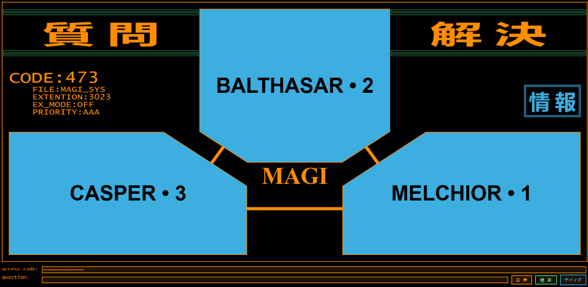

```
================================================================================
NERV TOKYO-3 HEADQUARTERS :: TACTICAL INFORMATION DIVISION
MAGI SYSTEM ARCHITECTURE SPECIFICATION — FILE: MAGI_SYS_2.0
PRIORITY: AAA | SECURITY CLASS: CONFIDENTIAL / RESTRICTED ACCESS
================================================================================
```

<p align="center">
  
</p>

```
[ ARCHITECTURE TYPE ]  TRI-AGENT PARALLEL CONSENSUS SUPERCOMPUTER
[ CONCEPT ORIGIN ]     DR. NAOKO AKAGI / MAGI STRUCTURE DESIGN
[ COGNITIVE ENGINE ]   OPENROUTER MULTI-MODEL DYNAMIC ROUTING
[ INTERFACE LOGIC ]    NEVR RETRO-TERMINAL GUI (DASH / REACT / WEB AUDIO API)
[ INPUT MODALITY ]     HYBRID VOICE SPEECH-TO-TEXT (WHISPER API / WEB SPEECH)
```

---

## 1. SYSTEM OVERVIEW

The **MAGI System 2.0** is an autonomous tri-agent consensus platform modeled after the computing infrastructure of NERV HQ. The system partitions complex decision-making across three distinct sub-computers representing fundamental fragments of human thought and personality:

* **MELCHIOR • 1 (MELCHIOR_LOGIC_UNIT)**
  - **Archetype:** The Scientist
  - **Directive:** Empirical truth, technical advancement, logical reasoning, and objective analysis.
  - **Persona Prompt:** *"You are a scientist. Your goal is to further our understanding of the universe and advance our technological progress."*

* **BALTHASAR • 2 (BALTHASAR_MATERNAL_UNIT)**
  - **Archetype:** The Mother
  - **Directive:** Risk aversion, protection of life, nurturing, ethics of care, and structural stability.
  - **Persona Prompt:** *"You are a mother. Your goal is to protect your children and ensure their well-being."*

* **CASPER • 3 (CASPER_PERSONAL_UNIT)**
  - **Archetype:** The Woman
  - **Directive:** Emotion, passion, intuition, personal desire, and individual human connection.
  - **Persona Prompt:** *"You are a woman. Your goal is to pursue love, dreams and desires."*

---

## 2. CONSENSUS RESOLUTION MATRIX

When a query is submitted to the MAGI network, all three sub-computers process the input simultaneously. Each agent's response is evaluated according to the following strict hierarchy:

```
+-----------------------------------------------------------------------------+
| STATUS CODE | KANJI  | DECISION TYPE | SYSTEM CONDITION                     |
+-----------------------------------------------------------------------------+
| YES         | 合 意  | AGREEMENT     | Unanimous unconditional affirmative. |
| NO          | 拒 絶  | REJECTION     | Vetoed by one or more agents.        |
| CONDITIONAL | 状 態  | STATE         | Approved with specific requirements. |
| INFO        | 情 報  | INFORMATION   | Non-binary open query response.      |
| ERROR       | 誤 差  | FAULT         | Subsystem API or execution failure.  |
+-----------------------------------------------------------------------------+
```

---

## 3. TECHNICAL ARCHITECTURE

### 3.1 Dynamic OpenRouter Multi-Model Allocation
Unlike single-model systems, MAGI System 2.0 allows independent LLM model assignment for each agent via environment variables (`.env`):

- `MODEL_MELCHIOR`: High-reasoning open model (e.g., `google/gemma-2-9b-it:free`)
- `MODEL_BALTHASAR`: Balanced protective model (e.g., `openai/gpt-4o-mini`)
- `MODEL_CASPER`: Intuitive/creative model (e.g., `meta-llama/llama-3.3-70b-instruct:free`)
- `MODEL_IS_YES_OR_NO`: Binary query classifier model
- `MODEL_CLASSIFY`: Verdict synthesis model

### 3.2 Diegetic Web Audio Engine
The system includes `assets/sound.js`, a native Web Audio API synthesizer that generates real-time audio feedback (NERV terminal prove beeps, processing hums, resolution fanfares) without external audio assets.

### 3.3 Reasoning Model Sanitization
Integrated support for chain-of-thought models (e.g., DeepSeek R1, Qwen Reasoning). Internal `<think>...</think>` meta-reasoning blocks are parsed and stripped prior to displaying final agent verdicts.

---

## 4. OPERATIONAL DEPLOYMENT PROCEDURES

### Prerequisites
- Python 3.9+
- OpenRouter API Key

### Installation Sequence

1. Clone repository workspace:
   ```bash
   git clone https://github.com/PersusUS/MAGI.git
   cd MAGI
   ```

2. Initialize virtual environment:
   ```bash
   python -m venv .venv
   
   # Windows PowerShell / CMD:
   .\.venv\Scripts\activate
   
   # Linux / macOS:
   source .venv/bin/activate
   ```

3. Install system dependencies:
   ```bash
   pip install -r requirements.txt
   ```

4. Configure environment parameters:
   ```bash
   cp .env.example .env
   ```
   Set `OPENROUTER_API_KEY` and model parameters in `.env`.

5. Execute MAGI Terminal Server:
   ```bash
   python main.py
   ```
   Access interface at: `http://127.0.0.1:8050`

### Autonomous Android / Termux Launch
For mobile tablet terminals, execute the launcher script:
```bash
bash magi_launcher.sh
```

---

## 5. REPOSITORY DIRECTORY STRUCTURE

```
MAGI/
├── main.py              # Dash application core, reactive callbacks & Flask STT route
├── ai.py                # OpenRouter integration, multi-model execution & prompt engine
├── magi_launcher.sh     # Autonomous launcher script for Termux / Android
├── requirements.txt     # Python dependencies
├── .env.example         # System configuration template
├── tests/
│   └── test_magi.py     # System unit test suite
├── components/          # React components loaded via dash_local_react_components
│   ├── magi.js          # Main terminal frame
│   ├── wise_man.js      # Individual MAGI agent panel
│   ├── response.js      # Global consensus indicator
│   ├── modal.js         # Inspection modal window
│   ├── status.js        # Extension status panel
│   └── header.js        # NERV section headers
└── assets/              # Static web assets
    ├── preview.png      # NERV System Interface Screenshot
    ├── sound.js         # Web Audio API sound synthesizer
    ├── stt.js           # Speech-To-Text microphone controller
    ├── style.css        # Evangelion NERV design stylesheet
    ├── manifest.json    # PWA application manifest
    └── icon.png         # MAGI NERV emblem
```

---

## 6. LICENSE & SECURITY CLASSIFICATION

This software is released under the **MIT License**.

- **Concept Credit:** Inspired by the MAGI supercomputer system created by Hideaki Anno / Gainax in *Neon Genesis Evangelion*.
- **Implementation:** MAGI System 2.0 OpenRouter Consensus Engine.

```
================================================================================
END OF SPECIFICATION DOCUMENT // NERV TACTICAL INFO SYS 2026
================================================================================
```
